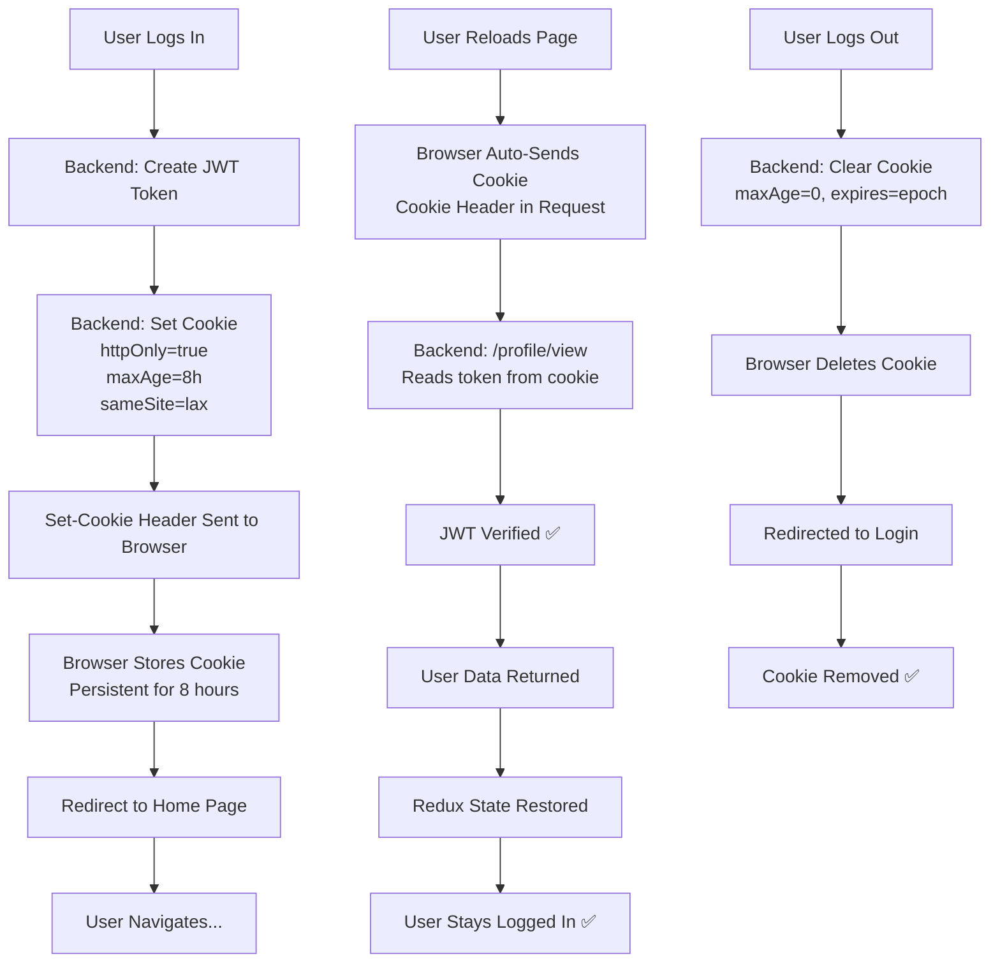

# 🔐 Authentication Persistence Fix - Verification Guide

## ✅ Issues Fixed

### Issue #1: Login Cookie Missing Expiration (CRITICAL)
**Root Cause:**
```javascript
// ❌ BEFORE - Login route
res.cookie("token", token, { httpOnly: true });
// This creates a SESSION COOKIE (deleted on reload!)

// ✅ AFTER - Login route with persistent cookie
res.cookie("token", token, {
  httpOnly: true,
  sameSite: "lax",
  secure: false,
  maxAge: 8 * 60 * 60 * 1000, // 8 hours
});
```

**Why This Mattered:**
- Without `maxAge` or `expires`, cookie becomes a SESSION cookie
- Session cookies are **deleted when browser closes or page reloads**
- Frontend would lose authentication on refresh ❌

### Issue #2: Inconsistent SameSite Configuration
```javascript
// ❌ BEFORE - Missing sameSite in login
res.cookie("token", token, { httpOnly: true });

// ✅ AFTER - Consistent sameSite across all routes
res.cookie("token", token, {
  httpOnly: true,
  sameSite: "lax",    // ← Added for security
  secure: false,      // ← Explicit for localhost
  maxAge: 8 * 60 * 60 * 1000,
});
```

### Issue #3: Frontend Already Correct ✅
- Body.jsx calls `fetchUser()` on mount
- All API calls use `withCredentials: true`
- Redux state management is proper
- No changes needed to frontend

---

## 📋 Step-by-Step Verification

### Step 1: Login Flow
```
1. Navigate to http://localhost:5174
2. Click "Sign Up" or go to login
3. Enter credentials:
   - Email: testuser@email.com (or any valid email)
   - Password: Test@123 (or any valid password)
4. Click "Login" / "Sign Up"
5. Verify:
   ✅ User is authenticated
   ✅ Redirected to home page
   ✅ User card/profile visible
```

### Step 2: Check Cookie in Browser
```
1. Open DevTools (F12)
2. Go to "Application" tab → "Cookies"
3. Select http://localhost:5174
4. Look for "token" cookie
5. Verify:
   ✅ Cookie name: "token"
   ✅ httpOnly: ✓ (checkmark)
   ✅ Secure: (empty for localhost - correct)
   ✅ SameSite: Lax
   ✅ Expires: (should be ~8 hours from now)
   ✅ Max-Age: ~28800 (8 hours in seconds)
```

### Step 3: Page Reload Test (THE CRITICAL TEST)
```
1. With user logged in, press F5 (refresh page)
2. Observe:
   ✅ Page reloads
   ✅ Frontend calls /profile/view
   ✅ Cookie is automatically sent by browser
   ✅ Backend verifies token
   ✅ User data returned
   ✅ Redux state restored
   ✅ User stays logged in ✅✅✅
   ❌ NO redirect to login
   ❌ NO "please log in" message
```

### Step 4: Multiple Reloads
```
1. Reload multiple times (F5, F5, F5)
2. Verify:
   ✅ User remains logged in every time
   ✅ No flickering or logout
   ✅ All pages accessible
```

### Step 5: Logout Test
```
1. Click Logout button in NavBar
2. Verify:
   ✅ Redirected to /login page
   ✅ Cookie is cleared from browser
   ✅ Attempting to reload shows login page
```

### Step 6: Network Inspector Test
```
1. Open DevTools (F12)
2. Go to "Network" tab
3. Refresh page (F5)
4. Click on the first request (usually document or XHR)
5. Check "Request Headers":
   ✅ Should see "Cookie: token=..."
6. This proves:
   ✅ Browser is sending cookie
   ✅ CORS credentials allowed
   ✅ Backend can read it
```

---

## 🔍 What Changed in Backend

### File: `src/routes/auth.js`

#### Before:
```javascript
authRouter.post("/login", async (req, res) => {
  ...
  const token = await user.getJWT();
  res.cookie("token", token, { httpOnly: true }); // ❌ Missing config!
  res.send(user);
});
```

#### After:
```javascript
authRouter.post("/login", async (req, res) => {
  ...
  const token = await user.getJWT();
  res.cookie("token", token, {
    httpOnly: true,                        // ✅ Prevent JS access
    sameSite: "lax",                       // ✅ CSRF protection
    secure: false,                         // ✅ Localhost (set true in production)
    maxAge: 8 * 60 * 60 * 1000,           // ✅ Persistent 8 hours
  });
  res.send(user);
});
```

**Same fix applied to `/signup` for consistency.**

---

## 🎯 How It Works Now

### Auth Flow After Fix:



---

## 🚀 Production Deployment

### For HTTP (localhost):
```javascript
res.cookie("token", token, {
  httpOnly: true,
  sameSite: "lax",
  secure: false,    // ✅ Correct for localhost
  maxAge: 8 * 60 * 60 * 1000,
});
```

### For HTTPS (production):
```javascript
res.cookie("token", token, {
  httpOnly: true,
  sameSite: "strict",  // Stricter for HTTPS
  secure: true,        // ✅ MUST be true for HTTPS
  maxAge: 8 * 60 * 60 * 1000,
});
```

---

## ✅ Checklist

- [ ] Backend running on port 7777
- [ ] Frontend running on port 5174
- [ ] Can login successfully
- [ ] Cookie visible in DevTools
- [ ] **PAGE RELOAD - USER STAYS LOGGED IN** ✅
- [ ] Multiple reloads work
- [ ] Logout works
- [ ] Cookie appears in network requests
- [ ] No 401 errors after reload
- [ ] No "please log in" messages after reload

---

## 🐛 Troubleshooting

### Problem: Still logging out after reload
**Solution:**
1. Check cookie in DevTools → Application → Cookies
2. If cookie is missing, issue is still with cookie config
3. If cookie is present but 401 error:
   - Check backend logs for JWT verification errors
   - Verify app.js has `cookieParser()` middleware

### Problem: Can't see cookie in DevTools
**Solution:**
1. Make sure you're checking the correct domain
2. Check "httpOnly" is enabled (should not see in JS console)
3. Try logging out and in again
4. Check browser doesn't have strict cookie policies enabled

### Problem: Gets 401 on /profile/view
**Solution:**
1. Check backend is actually sending the cookie
2. Verify CORS has `credentials: true`
3. Check JWT secret matches in auth.js and user.js
4. Restart backend server for config changes to take effect

---

## 📚 Key Concepts

| Concept | Explanation |
|---------|-------------|
| **httpOnly** | Prevents JavaScript access; sent only in HTTP requests |
| **sameSite** | CSRF protection; "lax" or "strict" values |
| **secure** | Only send over HTTPS (false for localhost) |
| **maxAge** | Lifetime in milliseconds (8 hours = 28,800,000 ms) |
| **Session Cookie** | Deleted when browser closes (bad for persistence) |
| **Persistent Cookie** | Remains until maxAge expires (good) |
| **withCredentials** | Tells Axios to include cookies in requests |

---

## Summary

✅ **Issue:** User logged out on page reload  
✅ **Root Cause:** Login cookie missing expiration (session cookie)  
✅ **Fix:** Added `maxAge` and `sameSite` to login route  
✅ **Result:** Cookie persists for 8 hours; user stays logged in  
✅ **Status:** READY FOR TESTING

